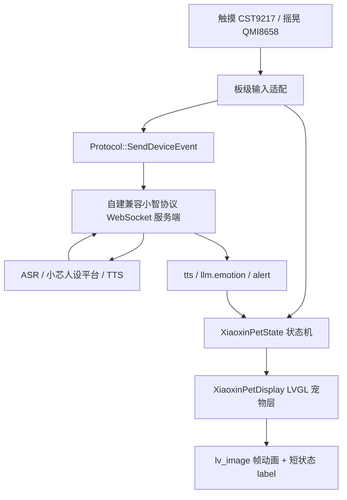

# 小芯 LVGL 桌宠硬件端 Implementation Plan

> **For agentic workers:** REQUIRED SUB-SKILL: Use superpowers:subagent-driven-development (recommended) or superpowers:executing-plans to implement this plan task-by-task. Steps use checkbox (`- [ ]`) syntax for tracking.

> **Current status, 2026-06-17:** This is the original implementation plan. The current Waveshare 1.46C implementation uses LVGL to play GIF resources from `main/assets/images` directly. See `docs/xiaoxin-lvgl-pet-hardware-plan.zh-CN.md` for the current-state design.

**Goal:** 在 Waveshare ESP32-S3-Touch-LCD-1.46C 上，把“小芯”做成常驻圆屏的校园情感陪伴桌宠，同时保留当前小智固件的语音、OTA、WebSocket 和音频链路。

**Architecture:** 本方案明确改为 **LVGL 适配方案**：小芯动画作为 LVGL 页面中的宠物层运行，不再采用 `paopao_pet` 的 `esp_lcd_panel_draw_bitmap` 直绘帧循环。固件继续沿用现有 `Display`、`SpiLcdDisplay`、`Protocol`、`Application` 抽象；板级文件只把默认显示从通用 LCD UI 切换为 `XiaoxinPetDisplay`，并把触摸、摇晃、本地桌宠状态和自建服务端事件打通。

**Tech Stack:** ESP-IDF、C/C++、LVGL 9.x、`esp_lvgl_port`、SPD2010 QSPI LCD、CST9217/I2C 触摸、QMI8658 六轴 IMU、I2S 麦克风/喇叭、当前小智 OTA/WebSocket/MCP 协议框架。

---

## 1. 方案结论

本次修正后的核心结论是：

- 小芯桌宠动画必须适配当前固件已有的 LVGL 显示体系。
- `D:\Learn\paopao_ui\firmware\paopao_pet` 只作为状态、动作、资源组织方式的参考；当前工程不再使用它的独立 LCD 直绘循环。
- 1.46C 圆屏上长期显示“小芯本体 + 短状态徽标”，不显示长聊天字幕。
- 语音对话仍走硬件端小智主链路，服务端由项目组自建，统一处理 ASR、小芯人设平台、TTS 和事件编排。
- 小程序带路能力不进入硬件 V1；硬件只保留接收服务端短提醒和触发本地互动事件的能力。

## 2. 硬件与项目背景

目标开发板为 [Waveshare ESP32-S3-Touch-LCD-1.46C](https://www.waveshare.net/shop/ESP32-S3-Touch-LCD-1.46C.htm)。2026-06-16 核对官方页面后，硬件要点如下：

- ESP32-S3R8，双核 LX7，最高 240MHz。
- 1.46 英寸圆形 LCD，412 x 412 分辨率，16.7M 色。
- 8MB PSRAM，16MB Flash。
- I2C 电容触摸，官方页面说明可运行 LVGL GUI。
- 板载 QMI8658 六轴惯性测量单元，可做角度、加速度检测。
- 板载麦克风、喇叭、音频相关芯片、Type-C、Micro SD、电池接口和 PWR/BOOT 按键。

小芯形象来源：

- 参考图：`C:\Users\dell\Downloads\57b262baeb5fec271711e4b802fc6b65.png`
- 视觉关键词：薄荷绿、白色毛绒质感、圆润机器人头部、大眼睛、耳罩、胸前圆形屏幕。
- 后续帧资产需要保持这一角色识别度，不能退回默认 emoji 或旧桌宠形象。

## 3. 当前工程事实

当前工程根目录：

```text
D:\Learn\hzcu-xiaoxin-firmwire
```

已核对到的关键现状：

- `sdkconfig` 当前已经选中 `CONFIG_BOARD_TYPE_WAVESHARE_ESP32_S3_TOUCH_LCD_1_46=y`。
- `sdkconfig.defaults` 仍然默认 `CONFIG_BOARD_TYPE_AI_PET_S3=y`，后续 clean build 会有回退风险。
- 1.46 板级文件位于 `main\boards\waveshare\esp32-s3-touch-lcd-1.46\esp32-s3-touch-lcd-1.46.cc`。
- `main\CMakeLists.txt` 使用 `file(GLOB ... boards/${MANUFACTURER}/${BOARD_TYPE}/*.cc)` 收集板级源码，新增 `xiaoxin_pet_*.cc` 后运行 `idf.py reconfigure` 即可刷新文件列表。
- 该板级文件当前定义了 `CustomLcdDisplay : public SpiLcdDisplay`，并在 `SetupUI()` 中调用 `SpiLcdDisplay::SetupUI()` 后添加圆屏 invalidation rounder 回调。
- 显示抽象位于 `main\display\display.h` 与 `main\display\lcd_display.h`，核心接口包括 `SetupUI()`、`SetStatus()`、`SetEmotion()`、`SetChatMessage()`、`ClearChatMessages()`。
- WebSocket hello 生成位于 `main\protocols\websocket_protocol.cc` 的 `WebsocketProtocol::GetHelloMessage()`，当前 features 内已有 `mcp`，可在此追加桌宠能力声明。
- 通用协议抽象位于 `main\protocols\protocol.h/.cc`，已有 `SendStartListening()`、`SendStopListening()`、`SendAbortSpeaking()`、`SendMcpMessage()` 等上行方法。

## 4. 范围边界

硬件 V1 要做：

- 小芯常驻圆屏 idle 动画。
- 语音状态联动：待机、连接、聆听、思考、说话、完成、错误。
- 触摸本地反馈：单击、长按、拖动。
- 摇晃本地反馈：QMI8658 只有检测到剧烈摇晃后才播放 `giddy` 动画，普通晃动不触发 `giddy`。
- 关键本地互动上报自建 WebSocket 服务端。
- 服务端下发 `tts`、`llm.emotion`、`alert` 时，硬件能切换小芯状态和短状态文案。
- 首次绑定可通过短码或二维码临时页面完成，绑定后回到小芯待机。

硬件 V1 不做：

- 不在硬件端实现校园带路逻辑。
- 不在屏幕上展示长聊天字幕。
- 不在固件里保存长期记忆。
- 不接入小智官方服务端作为正式业务依赖。
- 不引入和 LVGL 抢屏的直绘线程。

## 5. 总体架构



显示分层：

- 底层继续使用 SPD2010 QSPI LCD 初始化和 `SpiLcdDisplay`。
- `XiaoxinPetDisplay` 继承 `SpiLcdDisplay`，保留 LVGL display、theme、lock、preview、通知等基础能力。
- `SetupUI()` 中先调用父类 `SpiLcdDisplay::SetupUI()`，再创建桌宠层，并隐藏或弱化默认聊天文本。
- 桌宠层包含：
  - `pet_layer_`：全屏透明容器，负责接收触摸事件。
  - `pet_image_`：当前小芯动画帧。
  - `short_status_label_`：短状态徽标，位置固定在圆屏安全区域内。
  - `bind_overlay_`：绑定态临时覆盖层，用于短码或二维码。
- 帧更新通过 LVGL timer 或现有显示锁保护下的 `esp_timer` 回调调度，所有 LVGL 对象修改都在 LVGL 安全上下文中执行。

## 6. 文件规划

### `main\boards\waveshare\esp32-s3-touch-lcd-1.46\esp32-s3-touch-lcd-1.46.cc`

职责：

- 保留 I2C、TCA9554、QSPI、SPD2010、背光、按键和 I2S 音频初始化。
- 将当前 `CustomLcdDisplay` 替换或收敛为 `XiaoxinPetDisplay`。
- 保留圆屏 invalidation rounder 回调。
- 初始化 CST9217 触摸并接入 LVGL input。
- 初始化 QMI8658 或增加轮询任务，检测剧烈摇晃。
- 把触摸和摇晃事件同时分发给本地桌宠显示和协议事件上报。

### `main\boards\waveshare\esp32-s3-touch-lcd-1.46\xiaoxin_pet_display.h/.cc`

职责：

- 实现 `XiaoxinPetDisplay : public SpiLcdDisplay`。
- 管理 LVGL 宠物层、短状态 label、绑定态 overlay 和动画 timer。
- 覆盖 `SetupUI()`、`SetStatus()`、`SetEmotion()`、`SetChatMessage()`、`ClearChatMessages()`。
- 把通用状态文案映射为小芯动画状态。
- 长聊天内容只作为内部上下文或短提醒来源，不直接铺满屏幕。

### `main\boards\waveshare\esp32-s3-touch-lcd-1.46\xiaoxin_pet_state.h/.cc`

职责：

- 定义小芯状态和事件。
- 提供纯函数状态迁移，方便后续单测或串口日志验证。
- 输出稳定状态字符串，供 `device_event.state` 使用。

建议状态：

```cpp
enum class XiaoxinPetState {
    Idle,
    Waiting,
    Listening,
    Thinking,
    Speaking,
    Happy,
    Sleeping,
    Jumping,
    Failing,
};
```

建议事件：

```cpp
enum class XiaoxinPetEvent {
    AppIdle,
    AppConnecting,
    AppListening,
    AppThinking,
    AppSpeaking,
    AppDone,
    AppError,
    Tap,
    Hold,
    DragLeft,
    DragRight,
    Shake,
    SleepTimeout,
};
```

### `main\boards\waveshare\esp32-s3-touch-lcd-1.46\xiaoxin_pet_assets.h/.cc`

职责：

- 暴露 LVGL 可直接使用的帧资产。
- 采用和 `paopao_pet` 类似的 manifest 思路：状态 id、帧数组、帧数、fps、尺寸、安全区。
- 对外只暴露状态到动画的查询函数，显示层不关心 spritesheet 或单帧 C-array 的生成细节。

建议接口：

```cpp
struct XiaoxinPetAnimation {
    const char* id;
    const lv_image_dsc_t* const* frames;
    uint16_t frame_count;
    uint8_t fps;
};

const XiaoxinPetAnimation* XiaoxinPetAnimationForState(XiaoxinPetState state);
```

资产状态必须覆盖：

- `idle`
- `waiting`
- `listening`
- `thinking`
- `speaking`
- `happy`
- `sleeping`
- `jumping`
- `failing`

### `main\boards\waveshare\esp32-s3-touch-lcd-1.46\xiaoxin_pet_input.h/.cc`

职责：

- 封装触摸手势和 QMI8658 摇晃检测。
- 输出统一的 `XiaoxinPetEvent` 和协议事件字段。
- 包含触摸长按阈值、拖动阈值、摇晃阈值和冷却时间。

若板级文件保持很短，也可以先把输入逻辑放在 `esp32-s3-touch-lcd-1.46.cc`，但推荐单独拆出，避免板级文件继续膨胀。

### `main\protocols\protocol.h/.cc`

职责：

- 新增 `SendDeviceEvent()`。
- 序列化 `device_event` JSON。
- 复用当前 `session_id_` 和 `SendText()`。

建议接口：

```cpp
void SendDeviceEvent(const std::string& event,
                     const std::string& intent,
                     const std::string& state,
                     uint32_t timestamp_ms);
```

### `main\protocols\websocket_protocol.cc`

职责：

- 在 `GetHelloMessage()` 的 `features` 中声明硬件能力：

```json
{
  "device_events": true,
  "pet_display": "xiaoxin-lvgl-v1"
}
```

### `sdkconfig.defaults`

职责：

- 默认板级目标改为 Waveshare 1.46C。
- 保留当前中文语言、音频处理、OTA URL 等配置。
- 唤醒词固化为自定义 MultiNet 命令词“小芯”：`CONFIG_USE_CUSTOM_WAKE_WORD=y`、`CONFIG_CUSTOM_WAKE_WORD="xiao xin"`、`CONFIG_CUSTOM_WAKE_WORD_DISPLAY="小芯"`，并选择中文 `mn5q8_cn` 模型。

## 7. 状态映射

| 来源 | 条件 | 小芯状态 | 屏幕短状态 |
| --- | --- | --- | --- |
| 开机完成 | 进入待机 | `idle` | 空或 `待命` |
| Wi-Fi / WebSocket 连接中 | 连接未完成 | `waiting` | `连接中` |
| 单击小芯 | 本地触摸 | `happy` | `我在呢` |
| 长按小芯 | 睡眠切换 | `sleeping` 或 `idle` | `休息一下` / `醒啦` |
| 左右拖动 | 拖动方向 | `jumping` | 空 |
| 摇晃设备 | 剧烈加速度变化 | `giddy` | `怎么啦` |
| 设备开始聆听 | `kDeviceStateListening` | `listening` | `聆听中` |
| 用户语音识别完成 | 收到 `stt` | `thinking` | `想一想` |
| TTS 开始 | `type=tts,state=start` | `speaking` | `小芯说` |
| TTS 结束 | `type=tts,state=stop` | `idle` 或 `listening` | 空 |
| LLM 情绪 | `type=llm,emotion=happy` 等 | 映射到对应状态 | 情绪短文案 |
| 服务端提醒 | `type=alert` | `happy` / `failing` / `thinking` | 服务端短提醒 |
| 错误 | 网络或播放错误 | `failing` | `出错啦` |

情绪映射建议：

| 服务端 emotion | 小芯状态 |
| --- | --- |
| `happy` / `laughing` | `happy` |
| `neutral` / `calm` | `idle` |
| `thinking` | `thinking` |
| `sleepy` | `sleeping` |
| `sad` / `worried` | `failing` |
| 未识别字符串 | `idle` |

## 8. 设备事件接口

设备仍通过自建 OTA 地址获取 WebSocket 配置，并保持兼容当前小智 OTA/WebSocket/MCP 协议。

hello 里的 features 增加：

```json
{
  "mcp": true,
  "device_events": true,
  "pet_display": "xiaoxin-lvgl-v1"
}
```

本地桌宠互动上行：

```json
{
  "session_id": "...",
  "type": "device_event",
  "event": "pet_tap",
  "intent": "mood_checkin",
  "state": "idle",
  "ts": 123456
}
```

字段约束：

- `event`: `pet_tap`、`pet_hold`、`pet_drag`、`pet_shake`
- `intent`: `mood_checkin`、`sleep_toggle`、`local_play`
- `state`: `idle`、`waiting`、`listening`、`thinking`、`speaking`、`happy`、`sleeping`、`jumping`、`failing`
- `ts`: `esp_timer_get_time() / 1000` 得到的毫秒时间

发送策略：

- WebSocket 已连接时立即发送。
- WebSocket 未连接时，本地动画照常播放，事件不阻塞 UI。
- 首版不引入复杂离线队列；需要保留最近一次事件时，只允许一个固定长度小队列，避免内存膨胀。

## 9. 绑定态设计

硬件首次绑定只负责展示绑定入口，不承载完整账号体系：

- 服务端 OTA 或 hello 响应中返回短码或二维码内容。
- `XiaoxinPetDisplay` 进入 `binding` 临时覆盖层。
- 绑定层显示短码或二维码，底部保留极短文案，例如 `小程序绑定`。
- 绑定成功后服务端下发确认，硬件清除 overlay，回到 `idle`。
- 如果没有绑定信息，硬件仍可进入本地 idle 动画和基础语音连接流程。

二维码绘制建议后续使用项目已有二维码组件；如果当前工程没有二维码组件，先实现短码绑定，避免引入大依赖。

## 10. 实施任务

### Task 1: 固化板级默认配置

**Files:**

- Modify: `D:\Learn\hzcu-xiaoxin-firmwire\sdkconfig.defaults`

- [ ] 将旧默认板级：

```ini
CONFIG_BOARD_TYPE_AI_PET_S3=y
```

替换为：

```ini
CONFIG_BOARD_TYPE_WAVESHARE_ESP32_S3_TOUCH_LCD_1_46=y
```

- [ ] 保留以下配置：

```ini
CONFIG_IDF_TARGET="esp32s3"
CONFIG_LANGUAGE_ZH_CN=y
CONFIG_USE_AUDIO_PROCESSOR=y
CONFIG_OTA_URL="http://192.168.249.186:8003/xiaozhi/ota/"
```

- [ ] 将唤醒词配置固化为“小芯”：

```ini
CONFIG_USE_CUSTOM_WAKE_WORD=y
CONFIG_CUSTOM_WAKE_WORD="xiao xin"
CONFIG_CUSTOM_WAKE_WORD_DISPLAY="小芯"
CONFIG_CUSTOM_WAKE_WORD_THRESHOLD=20
CONFIG_SEND_WAKE_WORD_DATA=y
CONFIG_SR_MN_CN_MULTINET5_RECOGNITION_QUANT8=y
```

- [ ] 确认当前构建配置不再启用原“小智” WakeNet：

```ini
# CONFIG_USE_AFE_WAKE_WORD is not set
# CONFIG_SR_WN_WN9_NIHAOXIAOZHI_TTS is not set
```

- [ ] 运行：

```powershell
idf.py reconfigure
```

Expected: 配置完成，`sdkconfig` 中仍为 `CONFIG_BOARD_TYPE_WAVESHARE_ESP32_S3_TOUCH_LCD_1_46=y`，并启用 `CONFIG_USE_CUSTOM_WAKE_WORD=y`、`CONFIG_CUSTOM_WAKE_WORD_DISPLAY="小芯"`、`CONFIG_SR_MN_CN_MULTINET5_RECOGNITION_QUANT8=y`。

### Task 2: 增加小芯状态机

**Files:**

- Create: `D:\Learn\hzcu-xiaoxin-firmwire\main\boards\waveshare\esp32-s3-touch-lcd-1.46\xiaoxin_pet_state.h`
- Create: `D:\Learn\hzcu-xiaoxin-firmwire\main\boards\waveshare\esp32-s3-touch-lcd-1.46\xiaoxin_pet_state.cc`

- [ ] 在头文件中定义状态、事件和函数签名：

```cpp
#pragma once

enum class XiaoxinPetState {
    Idle,
    Waiting,
    Listening,
    Thinking,
    Speaking,
    Happy,
    Sleeping,
    RunningLeft,
    RunningRight,
    Failing,
};

enum class XiaoxinPetEvent {
    AppIdle,
    AppConnecting,
    AppListening,
    AppThinking,
    AppSpeaking,
    AppDone,
    AppError,
    Tap,
    Hold,
    DragLeft,
    DragRight,
    Shake,
    SleepTimeout,
};

XiaoxinPetState XiaoxinPetTransition(XiaoxinPetState current, XiaoxinPetEvent event);
const char* XiaoxinPetStateName(XiaoxinPetState state);
```

- [ ] 实现迁移规则：

```cpp
#include "xiaoxin_pet_state.h"

XiaoxinPetState XiaoxinPetTransition(XiaoxinPetState current, XiaoxinPetEvent event) {
    switch (event) {
        case XiaoxinPetEvent::Hold:
            return current == XiaoxinPetState::Sleeping ? XiaoxinPetState::Idle : XiaoxinPetState::Sleeping;
        case XiaoxinPetEvent::Tap:
            return current == XiaoxinPetState::Sleeping ? XiaoxinPetState::Sleeping : XiaoxinPetState::Happy;
        case XiaoxinPetEvent::DragLeft:
        case XiaoxinPetEvent::DragRight:
            return current == XiaoxinPetState::Sleeping ? XiaoxinPetState::Sleeping : XiaoxinPetState::Jumping;
        case XiaoxinPetEvent::Shake:
            return current == XiaoxinPetState::Sleeping ? XiaoxinPetState::Sleeping : XiaoxinPetState::Thinking;
        case XiaoxinPetEvent::AppConnecting:
            return current == XiaoxinPetState::Sleeping ? XiaoxinPetState::Sleeping : XiaoxinPetState::Waiting;
        case XiaoxinPetEvent::AppListening:
            return current == XiaoxinPetState::Sleeping ? XiaoxinPetState::Sleeping : XiaoxinPetState::Listening;
        case XiaoxinPetEvent::AppThinking:
            return current == XiaoxinPetState::Sleeping ? XiaoxinPetState::Sleeping : XiaoxinPetState::Thinking;
        case XiaoxinPetEvent::AppSpeaking:
            return current == XiaoxinPetState::Sleeping ? XiaoxinPetState::Sleeping : XiaoxinPetState::Speaking;
        case XiaoxinPetEvent::AppDone:
            return current == XiaoxinPetState::Sleeping ? XiaoxinPetState::Sleeping : XiaoxinPetState::Happy;
        case XiaoxinPetEvent::AppError:
            return XiaoxinPetState::Failing;
        case XiaoxinPetEvent::SleepTimeout:
            return XiaoxinPetState::Sleeping;
        case XiaoxinPetEvent::AppIdle:
        default:
            return current == XiaoxinPetState::Sleeping ? XiaoxinPetState::Sleeping : XiaoxinPetState::Idle;
    }
}

const char* XiaoxinPetStateName(XiaoxinPetState state) {
    switch (state) {
        case XiaoxinPetState::Idle: return "idle";
        case XiaoxinPetState::Waiting: return "waiting";
        case XiaoxinPetState::Listening: return "listening";
        case XiaoxinPetState::Thinking: return "thinking";
        case XiaoxinPetState::Speaking: return "speaking";
        case XiaoxinPetState::Happy: return "happy";
        case XiaoxinPetState::Sleeping: return "sleeping";
        case XiaoxinPetState::Jumping: return "jumping";
        case XiaoxinPetState::Failing: return "failing";
        default: return "idle";
    }
}
```

- [ ] 运行：

```powershell
idf.py reconfigure
idf.py build
```

Expected: CMake 刷新板级 GLOB 文件列表，新文件可被工程编译引用，没有枚举或头文件错误。

### Task 3: 增加 LVGL 帧资产合同

**Files:**

- Create: `D:\Learn\hzcu-xiaoxin-firmwire\main\boards\waveshare\esp32-s3-touch-lcd-1.46\xiaoxin_pet_assets.h`
- Create: `D:\Learn\hzcu-xiaoxin-firmwire\main\boards\waveshare\esp32-s3-touch-lcd-1.46\xiaoxin_pet_assets.cc`

- [ ] 头文件暴露 LVGL image descriptor 合同：

```cpp
#pragma once

#include <lvgl.h>
#include "xiaoxin_pet_state.h"

struct XiaoxinPetAnimation {
    const char* id;
    const lv_image_dsc_t* const* frames;
    uint16_t frame_count;
    uint8_t fps;
};

const XiaoxinPetAnimation* XiaoxinPetAnimationForState(XiaoxinPetState state);
```

- [ ] 首版资产生成约束：

```text
canvas: 412x412
pet_safe_box: 46, 36, 320, 320
status_safe_box: 76, 338, 260, 42
color_format: RGB565 or ARGB8888, consistent with LVGL config
frame_rate_idle: 6 fps
frame_rate_interaction: 10 fps
unused_cells: transparent
```

- [ ] 如果最终小芯帧还没有完成，先接入同尺寸占位帧，但占位帧也必须走 `lv_image_dsc_t`，显示层不允许写死颜色块或直接调用 `esp_lcd_panel_draw_bitmap`。

Expected: 替换正式小芯帧资产时，只修改 `xiaoxin_pet_assets.cc` 和生成出来的 C-array，不改显示逻辑。

### Task 4: 实现 `XiaoxinPetDisplay`

**Files:**

- Create: `D:\Learn\hzcu-xiaoxin-firmwire\main\boards\waveshare\esp32-s3-touch-lcd-1.46\xiaoxin_pet_display.h`
- Create: `D:\Learn\hzcu-xiaoxin-firmwire\main\boards\waveshare\esp32-s3-touch-lcd-1.46\xiaoxin_pet_display.cc`
- Modify: `D:\Learn\hzcu-xiaoxin-firmwire\main\boards\waveshare\esp32-s3-touch-lcd-1.46\esp32-s3-touch-lcd-1.46.cc`

- [ ] 头文件定义：

```cpp
#pragma once

#include "display/lcd_display.h"
#include "xiaoxin_pet_state.h"

class XiaoxinPetDisplay : public SpiLcdDisplay {
public:
    XiaoxinPetDisplay(esp_lcd_panel_io_handle_t io_handle,
                      esp_lcd_panel_handle_t panel_handle,
                      int width,
                      int height,
                      int offset_x,
                      int offset_y,
                      bool mirror_x,
                      bool mirror_y,
                      bool swap_xy);

    void SetupUI() override;
    void SetStatus(const char* status) override;
    void SetEmotion(const char* emotion) override;
    void SetChatMessage(const char* role, const char* content) override;
    void ClearChatMessages() override;
    void PlayPetEvent(XiaoxinPetEvent event, const char* short_status);

private:
    void SetPetState(XiaoxinPetState state, const char* short_status);
    void AdvanceFrame();
    void SetShortStatus(const char* text);

    lv_obj_t* pet_layer_ = nullptr;
    lv_obj_t* pet_image_ = nullptr;
    lv_obj_t* short_status_label_ = nullptr;
    lv_timer_t* animation_timer_ = nullptr;
    XiaoxinPetState pet_state_ = XiaoxinPetState::Idle;
    uint16_t frame_index_ = 0;
};
```

- [ ] `SetupUI()` 必须先调用父类：

```cpp
void XiaoxinPetDisplay::SetupUI() {
    SpiLcdDisplay::SetupUI();

    DisplayLockGuard lock(this);
    SetHideSubtitle(true);

    pet_layer_ = lv_obj_create(lv_screen_active());
    lv_obj_remove_style_all(pet_layer_);
    lv_obj_set_size(pet_layer_, LV_PCT(100), LV_PCT(100));
    lv_obj_center(pet_layer_);
    lv_obj_add_flag(pet_layer_, LV_OBJ_FLAG_CLICKABLE);

    pet_image_ = lv_image_create(pet_layer_);
    lv_obj_center(pet_image_);

    short_status_label_ = lv_label_create(pet_layer_);
    lv_obj_align(short_status_label_, LV_ALIGN_BOTTOM_MID, 0, -28);
    lv_label_set_text(short_status_label_, "");

    animation_timer_ = lv_timer_create([](lv_timer_t* timer) {
        auto* self = static_cast<XiaoxinPetDisplay*>(lv_timer_get_user_data(timer));
        self->AdvanceFrame();
    }, 1000 / 6, this);

    SetPetState(XiaoxinPetState::Idle, "");
}
```

- [ ] `SetStatus()` 只映射短状态和动画：

```cpp
void XiaoxinPetDisplay::SetStatus(const char* status) {
    if (status == nullptr) {
        SetPetState(XiaoxinPetState::Idle, "");
        return;
    }
    std::string text(status);
    if (text.find("聆听") != std::string::npos || text.find("Listening") != std::string::npos) {
        SetPetState(XiaoxinPetState::Listening, "聆听中");
    } else if (text.find("说话") != std::string::npos || text.find("Speaking") != std::string::npos) {
        SetPetState(XiaoxinPetState::Speaking, "小芯说");
    } else if (text.find("连接") != std::string::npos || text.find("Connecting") != std::string::npos) {
        SetPetState(XiaoxinPetState::Waiting, "连接中");
    } else {
        SetShortStatus(status);
    }
}
```

- [ ] `SetChatMessage()` 不显示长字幕：

```cpp
void XiaoxinPetDisplay::SetChatMessage(const char* role, const char* content) {
    if (role == nullptr || content == nullptr || content[0] == '\0') {
        return;
    }
    if (strcmp(role, "user") == 0) {
        SetPetState(XiaoxinPetState::Thinking, "想一想");
    } else if (strcmp(role, "assistant") == 0) {
        SetPetState(XiaoxinPetState::Speaking, "小芯说");
    }
}
```

Expected: 原来的系统通知、状态栏、绑定提示仍可由 LVGL 管理，小芯动画不会和 LVGL 抢屏。

### Task 5: 板级显示替换

**Files:**

- Modify: `D:\Learn\hzcu-xiaoxin-firmwire\main\boards\waveshare\esp32-s3-touch-lcd-1.46\esp32-s3-touch-lcd-1.46.cc`

- [ ] 引入头文件：

```cpp
#include "xiaoxin_pet_display.h"
```

- [ ] 将 `display_ = new CustomLcdDisplay(...)` 替换为：

```cpp
display_ = new XiaoxinPetDisplay(panel_io, panel,
                                 DISPLAY_WIDTH, DISPLAY_HEIGHT,
                                 DISPLAY_OFFSET_X, DISPLAY_OFFSET_Y,
                                 DISPLAY_MIRROR_X, DISPLAY_MIRROR_Y,
                                 DISPLAY_SWAP_XY);
```

- [ ] 保留当前 `rounder_event_cb` 逻辑。可以把它移动到 `XiaoxinPetDisplay::SetupUI()` 内，也可以保留板级辅助类，但最终只能有一个主显示类负责 UI。

Expected: `GetDisplay()` 返回的小芯显示对象仍然满足 `Display*` 接口。

### Task 6: 接入触摸和摇晃

**Files:**

- Modify: `D:\Learn\hzcu-xiaoxin-firmwire\main\boards\waveshare\esp32-s3-touch-lcd-1.46\esp32-s3-touch-lcd-1.46.cc`
- Create: `D:\Learn\hzcu-xiaoxin-firmwire\main\boards\waveshare\esp32-s3-touch-lcd-1.46\xiaoxin_pet_input.h`
- Create: `D:\Learn\hzcu-xiaoxin-firmwire\main\boards\waveshare\esp32-s3-touch-lcd-1.46\xiaoxin_pet_input.cc`

- [ ] 触摸事件映射：

```text
LV_EVENT_CLICKED -> Tap -> pet_tap / mood_checkin
LV_EVENT_LONG_PRESSED -> Hold -> pet_hold / sleep_toggle
LV_EVENT_PRESSING + x delta < -24 -> DragLeft -> pet_drag / local_play
LV_EVENT_PRESSING + x delta > 24 -> DragRight -> pet_drag / local_play
```

- [ ] 剧烈摇晃检测建议参数：

```text
sample_interval_ms: 40
accel_delta_threshold_g: 1.25
cooldown_ms: 1200
min_valid_samples: 2
```

- [ ] 本地反馈必须先发生：

```cpp
auto* pet_display = static_cast<XiaoxinPetDisplay*>(display_);
pet_display->PlayPetEvent(XiaoxinPetEvent::Shake, "怎么啦");
```

- [ ] 网络上报在本地反馈之后执行，WebSocket 不通时不能卡住动画。

Expected: 弱网或未连接服务端时，触摸仍有即时动画反馈；只有剧烈摇晃触发 `giddy`。

### Task 7: 增加 `device_event` 协议

**Files:**

- Modify: `D:\Learn\hzcu-xiaoxin-firmwire\main\protocols\protocol.h`
- Modify: `D:\Learn\hzcu-xiaoxin-firmwire\main\protocols\protocol.cc`
- Modify: `D:\Learn\hzcu-xiaoxin-firmwire\main\protocols\websocket_protocol.cc`

- [ ] 在 `Protocol` 中新增公开方法：

```cpp
void SendDeviceEvent(const std::string& event,
                     const std::string& intent,
                     const std::string& state,
                     uint32_t timestamp_ms);
```

- [ ] `protocol.cc` 序列化 JSON：

```cpp
void Protocol::SendDeviceEvent(const std::string& event,
                               const std::string& intent,
                               const std::string& state,
                               uint32_t timestamp_ms) {
    std::string message = "{\"session_id\":\"" + session_id_ +
        "\",\"type\":\"device_event\",\"event\":\"" + event +
        "\",\"intent\":\"" + intent +
        "\",\"state\":\"" + state +
        "\",\"ts\":" + std::to_string(timestamp_ms) + "}";
    SendText(message);
}
```

- [ ] 在 `WebsocketProtocol::GetHelloMessage()` 中追加：

```cpp
cJSON_AddBoolToObject(features, "device_events", true);
cJSON_AddStringToObject(features, "pet_display", "xiaoxin-lvgl-v1");
```

Expected: 自建服务端能从 hello 中识别桌宠能力，并收到 `device_event`。

### Task 8: 构建和真机验证

**Files:**

- Build output only.

- [ ] 运行：

```powershell
idf.py build
```

Expected: ESP32-S3、Waveshare 1.46C、LVGL 显示、协议新增方法全部编译通过。

- [ ] 烧录并监控：

```powershell
idf.py flash monitor
```

Expected:

- 开机后显示小芯 idle 动画。
- 切换到聆听、思考、说话、完成、错误状态时动画正确。
- 短状态文案不越出圆屏安全区。
- 长聊天文本不覆盖小芯主体。
- 单击、长按、拖动都有本地反馈；只有剧烈摇晃触发 `giddy`。
- 服务端在线时能收到 `pet_tap`、`pet_hold`、`pet_drag`、`pet_shake`。
- 服务端离线时本地互动不卡顿。

## 11. 验收标准

- 1.46C 板级默认配置不会回退到旧 `AI_PET_S3`。
- 小芯显示层基于 LVGL 对象和 LVGL timer，不使用独立 LCD 直绘循环。
- 小芯形象常驻主屏，默认 UI 不再以长字幕为中心。
- `Display` 接口调用仍能驱动动画状态变化。
- 触摸和剧烈摇晃在本地即时响应，并可选上报服务端；`giddy` 不由服务端情绪或 idle 自主动作触发。
- WebSocket hello 明确声明 `device_events` 和 `xiaoxin-lvgl-v1`。
- 自建服务端可通过现有 `tts`、`llm.emotion`、`alert` 触发硬件表情和短状态。
- 小程序带路逻辑未混入硬件 V1 固件。

## 12. 主要风险与处理

| 风险 | 处理 |
| --- | --- |
| LVGL 帧动画占用 Flash 或 PSRAM 过高 | 首版控制帧尺寸、帧数和 fps，优先 RGB565，按状态拆分动画 |
| 圆屏边缘裁切状态文字 | 固定 safe box，所有短状态 label 居中并限制宽度 |
| 触摸与系统按钮行为冲突 | 屏幕触摸只做桌宠互动，BOOT/PWR 仍保留原硬件按钮职责 |
| 摇晃误触发 | 使用高阈值、连续样本和冷却时间，避免普通晃动触发 `giddy` |
| 服务端未就绪 | 本地动画和语音链路可独立验证，`device_event` 只作为非阻塞增强 |
| 最终素材尚未切图 | 先接入同接口占位帧，正式帧替换时不改显示层 |

## 13. 执行顺序建议

1. 先改 `sdkconfig.defaults`，确保目标板稳定。
2. 先做 `xiaoxin_pet_state`，用串口日志确认状态迁移。
3. 再做 `xiaoxin_pet_assets` 占位帧和 `XiaoxinPetDisplay`，确认 LVGL 层能显示和切状态。
4. 接触摸，再接 QMI8658 剧烈摇晃。
5. 最后接协议上报和 hello feature。
6. 真机验证通过后，再替换为正式小芯帧资产。

## 14. 备注

当前文档只修改方案，不修改固件代码。进入执行阶段时，按 Task 1 到 Task 8 逐步落地，并在每个阶段完成后做一次 `idf.py build` 或真机验证。
