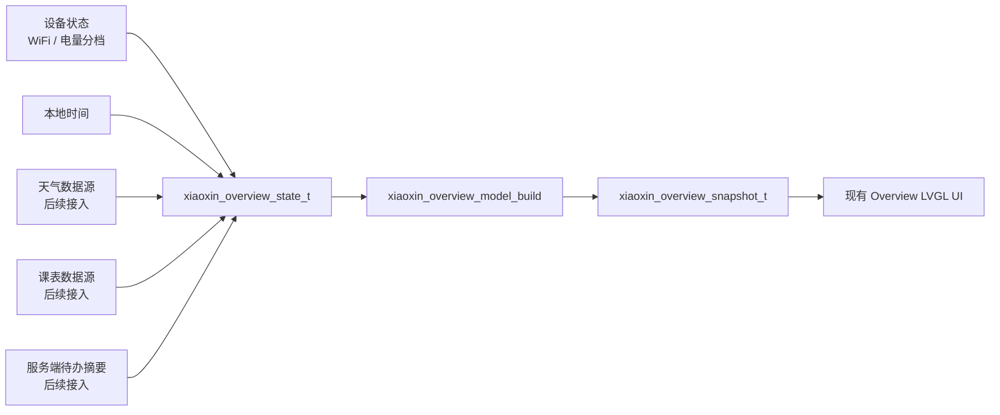

# 小芯真实总览数据接入设计规格

> 状态：已实现
> 日期：2026-06-19
> 设备：Waveshare ESP32-S3 Touch LCD 1.46
> 范围：保留当前 Overview UI，让时间、天气、课程、待办等真实数据可以接入显示

## 1. 目标

把现有 Overview 页从“示例内容展示”升级为“真实数据展示面板”：

- 保留当前总览页的整体视觉风格、四行卡片布局、图标、标题、主值、详情行。
- 在总览页上方增加一块稳定的时间日期区域。
- 把天气、课程、待办从硬编码示例文案改成可由真实数据源更新的摘要。
- 在没有联网、没有配置、没有数据时显示明确的降级状态，而不是显示假数据。
- 后续接入天气服务、课表配置、待办提醒时，只更新数据模型，不重写 UI 布局。

## 0. 落地状态

本规格已经在 `codex/xiaoxin-overview-card-density` 分支落地：

- Overview 内容生产路径已经从 `xiaoxin_card_pager.c` 静态示例数组迁出。
- `xiaoxin_overview_model_build()` 负责把状态输入转换为 `xiaoxin_overview_snapshot_t`。
- `RenderCardPage(XIAOXIN_CARD_PAGE_OVERVIEW, ...)` 只渲染 Overview 快照。
- 天气、课程、待办的真实后端尚未接入，当前显示明确的未同步、未配置或空状态。
- 设备状态卡片不显示 ADC 估算百分比，只显示粗粒度电量状态。
- Notifications 分页卡片、清理、空状态、手势和事件仓库未纳入本规格修改范围。

## 2. 非目标

- 不重新设计总览页视觉。
- 不在本轮接入真实天气 API、云端课表、云端待办服务。
- 不实现复杂设置页或 Web 配置面板。
- 不改变 Home / Notifications / Overview 的滑动分页状态机。
- 不修改 Notifications 分页的卡片数据、卡片渲染、左滑清理、全部清理、空状态和分页指示器。
- 不把天气、课程、待办的业务逻辑直接写进 LVGL 渲染代码。

## 3. 用户体验

### 3.1 顶部时间日期区域

Overview 页顶部保留一个独立区域显示本地时间和日期：

```text
14:32
6月19日 周五
```

时间区域始终显示在四张卡片上方。即使网络不可用，也应显示设备本地时间。如果系统时间尚未同步，可显示：

```text
--:--
时间未同步
```

### 3.2 四张总览卡片

四张卡片沿用当前结构：

```c
title
body
detail
tag
```

卡片顺序固定为：

1. 天气
2. 课程
3. 待办
4. 设备状态

前三张面向日常信息，第四张给设备自身留一个真实状态出口，避免离线时整页都像“空数据”。

## 4. 数据状态与降级文案

### 4.1 天气卡片

有真实天气数据时：

```text
天气
多云 26C
湿度72% · 东风2级
```

未联网或天气服务不可用时：

```text
天气
天气未同步
连接网络后更新
```

已联网但未配置城市或天气来源时：

```text
天气
未配置位置
设置位置后显示
```

### 4.2 课程卡片

有下一节课程时：

```text
下一节课
高数 10:10
教2-301 · 还有24分
```

课表为空或未配置时：

```text
下一节课
暂无课程
在配置中添加课表
```

有课表但今天没有课程时：

```text
下一节课
今日无课
可以安排自习
```

### 4.3 待办卡片

有待办时：

```text
今日待办
2 项待办
实验报告 · 晚自习
```

待办为空或未配置时：

```text
今日待办
暂无待办
添加提醒后显示
```

#### 4.3.1 今日待办真实功能边界

今日待办不建议在硬件端第一阶段实现完整编辑功能。推荐把服务端作为事实来源：

- 服务端负责创建、编辑、完成、过期、重复规则和“今日待办”筛选。
- 硬件端只同步摘要字段，用于总览页只读展示。
- 第一版同步字段保持轻量：`todo_configured`、`todo_count`、`todo_detail`。
- 后续如需更准确表达离线状态，可增加 `todo_last_synced_at` 或缓存有效期。
- 离线时，如果已有缓存摘要，可以继续显示缓存内容；如果从未同步或未配置，则显示 `暂无待办` / `添加提醒后显示`。

这样可以让总览页先成为可靠摘要入口，避免在小圆屏上做复杂待办编辑表单。

### 4.4 设备状态卡片

正常联网时：

```text
设备状态
WiFi 已连接
电量充足
```

未联网时：

```text
设备状态
离线模式
电量正常
```

如果电量不可读取：

```text
设备状态
离线模式
电量未知
```

设备状态卡片不显示精确电量百分比。Waveshare 1.46 板子的电量来自 ADC 估算，百分比容易给用户造成“精确读数”的误解；模型可以继续使用内部估算值做分档，但 UI 只显示状态文案：

| 内部估算区间 | Overview 文案 |
| --- | --- |
| `>= 60` | `电量充足` |
| `30-59` | `电量正常` |
| `15-29` | `电量偏低` |
| `< 15` | `请尽快充电` |
| 不可读取 | `电量未知` |

### 4.5 天气与课程接入边界

天气和课程与待办类似，推荐由服务端或上位配置系统完成重逻辑：

- 天气：服务端按用户配置的位置调用天气 API，再同步 `weather_configured`、`weather_available`、`weather_summary`、`weather_detail` 到设备。
- 课程：服务端或配置端维护课表，设备只接收“下一节课”或“今日无课”的摘要。
- 硬件端不直接承担第三方 API 鉴权、复杂课表规则或长列表编辑，只负责展示最近一次同步结果和降级状态。

## 5. 架构

新增一个独立的 Overview 数据模型模块，负责把真实状态转换成 UI 已经能渲染的卡片条目。

实现文件：

| 文件 | 职责 |
| --- | --- |
| `xiaoxin_overview_model.h` | 定义 Overview 输入状态、输出条目、刷新 API |
| `xiaoxin_overview_model.c` | 生成时间日期文本和四张总览卡片 |
| `xiaoxin_card_pager.c` | 仅移除 Overview 示例数组；Notifications 相关逻辑保持不变 |
| `esp32-s3-touch-lcd-1.46.cc` | 读取 Overview 模型输出并渲染现有 UI |

`xiaoxin_card_pager.c` 保留页面枚举和通知逻辑，但生产路径的 Overview 内容必须来自 `xiaoxin_overview_snapshot_t`。本轮不得修改 Notifications 分页卡片行为。

### 5.1 输入状态

Overview 模型接收一个轻量状态结构：

```c
typedef struct {
  bool time_valid;
  int hour;
  int minute;
  int month;
  int day;
  uint8_t weekday;

  bool network_connected;
  int battery_percent;
  bool battery_known;

  bool weather_available;
  bool weather_configured;
  const char* weather_summary;
  const char* weather_detail;

  bool course_configured;
  bool course_available_today;
  const char* course_title;
  const char* course_detail;

  bool todo_configured;
  uint8_t todo_count;
  const char* todo_detail;
} xiaoxin_overview_state_t;
```

第一版允许调用方用局部静态字符串或已有状态填充这些字段。后续接入网络服务时，可以保持这个输入结构不变。

### 5.2 输出结构

模型输出：

```c
typedef struct {
  char time_text[8];
  char date_text[24];
  xiaoxin_card_item_t items[4];
  uint8_t item_count;
} xiaoxin_overview_snapshot_t;
```

`items` 继续复用当前 UI 已支持的 `xiaoxin_card_item_t`，包括 `title`、`body`、`detail`、`tag`、`priority`、`ttl_ms`。

这里的“快照”指一次渲染用的稳定数据包。UI 层拿到快照后，只按照其中的文本和条目刷新标签；天气、课程、待办、电量分档等判断都在模型层完成。这样后续数据来源改变时，只需要更新 `xiaoxin_overview_state_t` 的填充方式，不需要改卡片布局。

### 5.3 生成规则

`xiaoxin_overview_model_build()` 根据输入状态生成快照：

- 时间有效：格式化为 `HH:MM` 和 `M月D日 周X`。
- 时间无效：输出 `--:--` 和 `时间未同步`。
- 天气优先区分“未联网”和“未配置位置”；未联网优先显示同步状态，联网后再提示位置配置。
- 课程优先区分“未配置课表”和“今天无课”。
- 待办优先区分“未配置/为空”和“有待办”。
- 设备状态始终尽量显示真实网络和电量状态，但不展示 ADC 推算出的精确百分比。

天气状态优先级固定为：

1. `network_connected == false`：显示 `天气未同步` / `连接网络后更新`。
2. `weather_configured == false`：显示 `未配置位置` / `设置位置后显示`。
3. `weather_available == true`：显示真实天气。
4. 其他情况：显示 `天气未同步` / `连接网络后更新`。

课程状态优先级固定为：

1. `course_configured == false`：显示 `暂无课程` / `在配置中添加课表`。
2. `course_available_today == false`：显示 `今日无课` / `可以安排自习`。
3. 其他情况：显示下一节课程信息。

待办状态优先级固定为：

1. `todo_configured == false || todo_count == 0`：显示 `暂无待办` / `添加提醒后显示`。
2. `todo_count > 0`：显示待办数量和摘要。

## 6. 数据流



LVGL 层只接收 `xiaoxin_overview_snapshot_t`，不判断天气、课程、待办的业务状态。

## 7. UI 调整

### 7.1 保持项

- 保持四张总览卡片。
- 保持现有图标背景、标题、主值、详情行和箭头。
- 保持当前 Overview 页面进入/退出动画。
- 保持小圆屏上的信息密度克制，每张卡片只显示一行主值和一行详情。

### 7.2 新增项

- 在 Overview 卡片上方增加时间日期对象。
- 为时间日期设置固定宽度和位置，避免动态文本导致布局跳动。
- 如果顶部空间不足，实现时优先略微下移四张卡片；仍不足时再减小行间距，但不增加第五张卡片。

## 8. 示例数据策略

当前硬编码示例内容不再作为生产默认值。

后续如果仍需要演示效果，可以保留一个测试或开发 fixture，例如：

```c
xiaoxin_overview_state_t xiaoxin_overview_demo_state(void);
```

生产路径默认应使用真实状态和降级文案。没有真实天气、课程、待办时，显示“未同步”“未配置”“暂无”，而不是显示假的高数、天气和待办。

## 9. 错误处理

- 所有外部文本字段允许为 `NULL`，模型必须输出安全的空态文案。
- 长文本需要在模型层截断或在 UI 层使用 LVGL long mode，避免压到右侧箭头。
- 网络断开不应清空已配置的课程/待办；只影响天气同步和设备摘要。
- 时间未同步时不影响四张卡片渲染。

## 10. 测试计划

新增纯 C 单元测试，覆盖 Overview 模型：

- 时间有效时格式化 `HH:MM` 和中文日期。
- 时间无效时显示 `--:--` / `时间未同步`。
- 天气已同步时显示真实天气。
- 未联网时天气显示 `天气未同步` / `连接网络后更新`。
- 未配置天气位置时显示 `未配置位置`。
- 课表未配置、今日无课、有下一节课三种状态。
- 待办为空、有待办两种状态。
- 设备状态在联网、离线、电量分档、电量不可读时输出正确。
- Notifications 分页卡片相关测试继续通过；本轮不新增、不修改通知分页卡片行为。

现有卡片分页测试继续验证页面切换、通知中心和 Overview 条目数量。

## 11. 验收标准

- Overview 页不再直接显示硬编码假课程、假天气、假待办。
- 没有联网时，天气卡片显示离线/未同步状态。
- 没有课程或待办配置时，课程和待办卡片显示明确空状态。
- 有真实或注入数据时，四张卡片能显示为当前示例 UI 的丰富形态。
- UI 渲染层只消费 Overview 快照，不直接拼接业务文案。
- Notifications 分页卡片没有行为或视觉改动。
- 本地模型测试通过。
