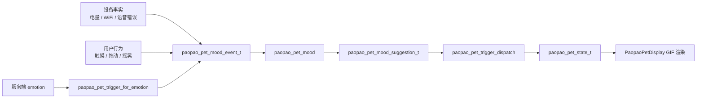

# 小芯宠物情绪系统设计规格

> 状态：设计中
> 日期：2026-06-21
> 设备：Waveshare ESP32-S3 Touch LCD 1.46
> 范围：在现有泡泡宠物 GIF、触发器和状态机基础上，增加可测试的情绪策略层

## 1. 目标

让小芯不只是响应单个状态播放 GIF，而是能根据设备状态和用户行为表现出更稳定、更有性格的情绪反馈：

- 低电量时表现疲惫或焦虑。
- 长时间无交互时自然进入打盹或空闲小动作。
- 用户触摸、拖动、摇晃后给出即时反馈。
- 语音识别失败、网络断开等异常能影响宠物表现。
- 网络恢复、任务完成等正向事件给出轻量成功反馈。
- 情绪逻辑集中在独立模块，避免散落在 LVGL 显示代码中。

第一版重点是“稳”和“可解释”，不追求复杂养成系统。情绪系统应优先改善日常使用中的生命感，同时保持动画切换克制，避免小圆屏上频繁跳动。

## 2. 当前基础

项目已经有一套可用的宠物动画基础：

- `paopao_pet_state.h/.c` 定义核心宠物状态，例如 `IDLE`、`SPEAKING`、`THINKING`、`HAPPY`、`TIRED`、`ANXIETY`。
- `paopao_pet_trigger.h/.c` 维护 `base_state`、`reaction_state`、短反应时长、睡眠、错误锁定和本地交互优先级。
- `paopao_pet_emotion.h/.c` 将服务端 `llm.emotion` 字符串归一到宠物触发事件。
- `paopao_pet_gif_assets.c` 将宠物状态映射到 GIF 资源。
- `esp32-s3-touch-lcd-1.46.cc` 已接入屏幕触摸、IMU 摇晃、电量读取、网络/设备状态和显示刷新；BOOT 按键不再作为宠物 mood/trigger 触发源。
- `docs/xiaoxin-pet-emotion-gif-mapping.zh-CN.md` 已记录 GIF 含义、服务端 emotion 归一规则和测试覆盖。

因此，P1 不应重写宠物动画系统，而应在现有触发器前增加一层“情绪策略”。

## 3. 非目标

- 不新增复杂养成、等级、亲密度、长期记忆或云端宠物画像。
- 不在第一版新增必须依赖的新 GIF 资源。
- 不把天气、课程、待办等 Overview 数据直接接入宠物情绪。
- 不让 UI 渲染代码直接判断业务状态，例如“低电量就播放 tired.gif”。
- 不改变现有 Home / Notifications / Overview 分页交互。
- 不改变服务端 `llm.emotion` 的协议字段。
- 不让普通情绪覆盖错误锁定、语音监听、说话等关键基础状态。
- 不把 Boot 按键作为 P1 情绪系统的必要输入；该按键可闲置出来，保留给系统、调试、设置入口或后续产品决策。

## 4. 方案比较

### 4.1 方案 A：继续扩展现有 trigger

把低电量、断网、语音错误等事件全部直接加到 `paopao_pet_trigger_dispatch()` 中。

优点：

- 改动少。
- 能最快看到 GIF 变化。

缺点：

- trigger 会同时承担输入归一、业务判断、优先级、冷却和状态切换，后续会膨胀。
- 难以表达“连续状态”对心情的影响。
- 测试会越来越像覆盖大量分支，而不是验证一套策略。

### 4.2 方案 B：新增独立 mood policy 层

新增 `paopao_pet_mood` 模块，接收设备和用户事件，输出推荐触发事件、短文案、优先级和冷却时间。现有 trigger 继续负责最终动画状态切换。

优点：

- 复用现有 `paopao_pet_trigger`，风险低。
- 情绪规则集中，可单测。
- UI 层只消费结果，不知道情绪算法细节。
- 后续可以自然扩展能量值、心情值和异常标记。

缺点：

- 需要新增一个模块和一组事件结构。
- 第一版需要明确 mood 与 trigger 的边界，避免两边重复做优先级。

### 4.3 方案 C：重做完整宠物状态机

把基础状态、短反应、设备异常、服务端 emotion 和长期情绪统一重写成一个大状态机。

优点：

- 理论上模型统一。
- 长期可表达更复杂的宠物性格。

缺点：

- 改动面大，容易破坏已有动画、触摸和语音状态。
- 与当前已有测试和文档重复。
- 对 P1 第一版过重。

### 4.4 推荐

选择方案 B：新增独立 mood policy 层。

第一版把 mood 作为“事件仲裁和情绪建议器”，只输出现有 trigger 能理解的事件。这样可以先获得明显体验提升，同时保留现有状态机的稳定性。

## 5. 用户体验

### 5.1 低电量

当电量进入低电量区间时，小芯短暂播放 `tired.gif`。如果低电量持续存在，不应每次电量刷新都重复播放。用户离开 Home 页时也不强制打断当前页面。

建议表现：

- 首次进入低电量：播放 `TIRED` 短反应。
- 低电量持续：维持系统浮层和通知中心提示，不频繁重复情绪动画。
- 从低电量恢复：可播放一次 `DONE` 轻反馈。

### 5.2 网络状态

网络断开时，小芯可以表现轻微焦虑；网络恢复时，给一次轻量成功反馈。

建议表现：

- WiFi 断开或配网中：播放 `ANXIETY`，冷却较长。
- WiFi 恢复：播放 `DONE`，如果后续接入 `waving.gif`，可用作恢复/欢迎反馈。
- 断网不应覆盖正在说话或监听的状态。

### 5.3 本地交互

触摸、拖动和摇晃继续保持最高的即时反馈优先级。Boot 按键不纳入 P1 情绪系统的必需交互，可以从宠物情绪路径中闲置出来。

建议表现：

- 短点按：沿用 `DONE` 或在 mood 较高时升级为 `HAPPY`。
- 长按：如果来自屏幕触摸长按，可沿用睡眠切换；如果来自 Boot 按键，P1 不接入。
- 拖动：沿用 `JUMPING`。
- 摇晃：沿用 `GIDDY`，并有 IMU 冷却。

第一版不改变触摸、拖动、摇晃的直觉反馈，只让它们更新 mood 里的 `last_interaction_ms`、`energy` 和 `mood`。Boot 按键可以不再触发 mood，也不再作为验收条件。

### 5.4 语音与聊天

语音基础状态继续由现有 trigger 控制：

- 监听：`WAITING`
- 思考：`THINKING`
- 说话：`SPEAKING`
- 任务完成：`DONE`
- 错误：`FAILING` 或短失败反应

mood 层只在边缘事件上提供建议：

- 识别失败：建议 `SERVICE_THINKING` 或 `SERVICE_FAILING`，冷却 2 到 5 秒。
- 助手积极回复或服务端 happy emotion：沿用 `SERVICE_HAPPY`。
- 普通 neutral emotion：不打断当前基础状态。

### 5.5 空闲与睡眠

现有 trigger 已支持 idle 后空闲小动作和 60 秒睡眠。mood 层不重复实现睡眠状态机，但可以记录能量值，用于后续调节睡眠阈值。

第一版保持：

- 空闲约 20 秒：可能播放 `REVIEW` 小动作。
- 空闲约 60 秒：进入 `SLEEPING`。
- 本地触摸、摇晃、语音状态可以唤醒。

## 6. 架构

新增模块：

| 文件 | 职责 |
| --- | --- |
| `paopao_pet_mood.h` | 定义 mood 输入事件、上下文、输出建议和公开 API |
| `paopao_pet_mood.c` | 实现情绪分数、异常标记、优先级和冷却规则 |
| `tests/paopao_pet_mood_test.c` | 覆盖 mood 规则和冷却 |

保留模块职责：

| 文件 | 职责 |
| --- | --- |
| `paopao_pet_trigger.h/.c` | 执行最终动画状态切换，维护 base/reaction、睡眠、错误锁定 |
| `paopao_pet_emotion.h/.c` | 服务端 emotion 字符串归一 |
| `esp32-s3-touch-lcd-1.46.cc` | 收集真实设备事件，调用 mood，再把建议派发给 trigger |
| `xiaoxin_system_overlay.*` | 继续负责系统浮层显示 |
| 通知中心模块 | 继续负责低电量、WiFi、语音错误等通知事件 |

### 6.1 输入事件

mood 层使用统一事件，而不是直接依赖 LVGL 或板级类：

```c
typedef enum {
  PAOPAO_PET_MOOD_EVENT_NONE = 0,
  PAOPAO_PET_MOOD_EVENT_TICK,
  PAOPAO_PET_MOOD_EVENT_LOCAL_TAP,
  PAOPAO_PET_MOOD_EVENT_LOCAL_HOLD,
  PAOPAO_PET_MOOD_EVENT_LOCAL_DRAG,
  PAOPAO_PET_MOOD_EVENT_LOCAL_SHAKE,
  PAOPAO_PET_MOOD_EVENT_BATTERY_LOW,
  PAOPAO_PET_MOOD_EVENT_BATTERY_RECOVERED,
  PAOPAO_PET_MOOD_EVENT_WIFI_DISCONNECTED,
  PAOPAO_PET_MOOD_EVENT_WIFI_CONNECTED,
  PAOPAO_PET_MOOD_EVENT_VOICE_ERROR,
  PAOPAO_PET_MOOD_EVENT_CHAT_STARTED,
  PAOPAO_PET_MOOD_EVENT_ASSISTANT_REPLY,
  PAOPAO_PET_MOOD_EVENT_SERVICE_EMOTION
} paopao_pet_mood_event_t;
```

服务端 emotion 需要携带归一后的 trigger。为避免把字符串匹配逻辑重复写进 mood 层，输入使用一个薄结构：

```c
typedef struct {
  paopao_pet_mood_event_t event;
  paopao_pet_trigger_event_t service_trigger;
} paopao_pet_mood_input_t;
```

除 `PAOPAO_PET_MOOD_EVENT_SERVICE_EMOTION` 外，`service_trigger` 可填 `PAOPAO_PET_TRIGGER_NONE`。

### 6.2 上下文

```c
typedef struct {
  int8_t energy;
  int8_t mood;
  uint32_t last_interaction_ms;
  uint32_t last_reaction_ms;
  uint32_t low_battery_last_ms;
  uint32_t wifi_alert_last_ms;
  uint32_t voice_error_last_ms;
  bool low_battery;
  bool wifi_connected;
} paopao_pet_mood_context_t;
```

分数范围建议为 `0..100`：

- `energy` 默认 70，低电量、长时间无交互降低；触摸、唤醒、充电恢复提高。
- `mood` 默认 60，积极互动提高；语音错误、断网、反复摇晃降低。

第一版不需要把分数直接显示给用户，只用于决定事件是否升级为 `HAPPY`、`TIRED` 或 `ANXIETY`。

### 6.3 输出建议

```c
typedef struct {
  bool has_trigger;
  paopao_pet_trigger_event_t trigger;
  const char* text;
  uint8_t priority;
  uint32_t cooldown_ms;
} paopao_pet_mood_suggestion_t;
```

`text` 是短文案预留，用于后续气泡或调试日志。第一版 UI 可以不显示短文案，但 mood 模块仍应输出稳定文案，便于测试和后续扩展。

### 6.4 API

```c
void paopao_pet_mood_init(paopao_pet_mood_context_t* ctx, uint32_t now_ms);

paopao_pet_mood_suggestion_t paopao_pet_mood_handle_event(
  paopao_pet_mood_context_t* ctx,
  const paopao_pet_mood_input_t* input,
  uint32_t now_ms
);
```

调用方拿到 `suggestion.has_trigger == true` 后，再调用：

```c
paopao_pet_trigger_dispatch(&trigger_ctx, suggestion.trigger, now_ms);
```

## 7. 优先级与冷却

### 7.1 总体优先级

最终显示仍由 `paopao_pet_trigger` 仲裁。mood 层不应绕过 trigger 的错误锁定、睡眠和基础语音规则。

建议优先级：

1. 硬错误和错误锁定。
2. 语音基础状态：监听、思考、说话。
3. 本地交互：触摸、拖动、摇晃。
4. 设备异常：低电量、断网、语音错误。
5. 服务端 emotion。
6. 空闲小动作。

### 7.2 冷却时间

| 事件 | 建议触发 | 冷却 |
| --- | --- | --- |
| 低电量进入 | `SERVICE_TIRED` | 30 秒 |
| 电量恢复 | `TASK_DONE` | 10 秒 |
| WiFi 断开 | `SERVICE_ANXIOUS` | 20 秒 |
| WiFi 恢复 | `TASK_DONE` | 10 秒 |
| 语音识别失败 | `SERVICE_THINKING` 或 `SERVICE_FAILING` | 3 秒 |
| 本地短点按 | `LOCAL_TAP` 或 mood 高时 `SERVICE_HAPPY` | 沿用 trigger |
| 摇晃 | `LOCAL_SHAKE` | 沿用 IMU 1.8 秒冷却 |
| 服务端 happy/sad 等 emotion | 已有 service trigger | 1.5 到 2 秒 |

冷却只限制 mood 层重复建议，不应阻止 trigger 处理本地交互和关键语音状态。

## 8. 数据流



服务端 emotion 可以保持现有路径直接进 trigger，也可以先经过 mood 层做冷却。第一版推荐保守接入：先用 `paopao_pet_trigger_for_emotion()` 归一字符串，再把归一结果作为 `service_trigger` 交给 mood 层；mood 层只决定是否因冷却或当前状态抑制该建议，不重复解析字符串。

## 9. 接入点

### 9.1 板级状态刷新

在板级读取电量和网络状态的位置，检测状态边沿：

- `battery_low: false -> true`：发送 `BATTERY_LOW`。
- `battery_low: true -> false`：发送 `BATTERY_RECOVERED`。
- `wifi_connected: true -> false`：发送 `WIFI_DISCONNECTED`。
- `wifi_connected: false -> true`：发送 `WIFI_CONNECTED`。

不要在每次轮询都发送异常事件。mood 层处理边沿事件，持续状态由系统浮层和通知中心表达。

### 9.2 触摸、拖动和摇晃

现有触摸、拖动和摇晃仍可以直接派发 trigger，以保持即时性。与此同时调用 mood 更新分数：

- tap：提高 mood，刷新 `last_interaction_ms`。
- drag：提高 energy，刷新 `last_interaction_ms`。
- touch hold：不改变 mood 或轻微降低 energy，可用于睡眠切换。
- shake：短期提高刺激感，但频繁摇晃降低 mood。

BOOT 按键不作为 P1 情绪系统输入。当前实现已将 BOOT 从宠物 mood/trigger 路径中移除：单击保留启动阶段进入 WiFi 配置、其他状态切换聊天等系统行为；长按预留给后续系统、设置或调试入口。

### 9.3 语音和聊天

在 `SetStatus()`、`SetChatMessage()` 或对应板级包装处同步 mood 事件：

- listening / thinking / speaking：发送 `CHAT_STARTED` 或专门语音状态事件。
- assistant reply：发送 `ASSISTANT_REPLY`。
- error：发送 `VOICE_ERROR`。

第一版可以只接入语音错误和助手回复，避免改动过多显示路径。

## 10. 短文案

第一版文案只作为输出字段和日志，不强制显示。建议预留：

| 场景 | 文案 |
| --- | --- |
| 低电量 | `有点没电了` |
| 电量恢复 | `好多啦` |
| WiFi 断开 | `网络不见了` |
| WiFi 恢复 | `连上啦` |
| 语音识别失败 | `我再想想` |
| 触摸开心 | `收到` |
| 久未互动 | `打个盹` |

如果后续要显示气泡，必须单独设计气泡位置、持续时间和遮挡规则；本规格不把气泡显示纳入第一版。

## 11. 测试计划

新增 `tests/paopao_pet_mood_test.c`，覆盖：

- 初始化后 `energy`、`mood` 和网络/电量默认值稳定。
- 低电量边沿触发 `SERVICE_TIRED`。
- 低电量冷却期内不重复触发。
- 电量恢复触发一次 `TASK_DONE`。
- WiFi 断开触发 `SERVICE_ANXIOUS`，恢复触发 `TASK_DONE`。
- 语音错误触发失败或思考短反应，并受 3 秒冷却限制。
- 本地触摸提高 mood，并刷新 `last_interaction_ms`。
- 高频服务端 emotion 受冷却限制，普通 neutral 或未识别 emotion 不产生建议。
- 服务端 emotion 测试使用已归一的 `service_trigger`，不在 mood 测试里重复验证字符串匹配。
- mood 输出永远只使用 `paopao_pet_trigger_event_t`，不直接返回 GIF 文件名。

保留现有测试：

- `tests/paopao_pet_trigger_test.c`
- `tests/paopao_pet_emotion_test.c`
- `tests/paopao_pet_gif_assets_test.c`
- `tests/paopao_gif_probe_decode_test.c`

如果后续修改 trigger 行为，必须同步更新这些测试。

## 12. 验收标准

- 新增 mood 模块后，UI 渲染层不包含低电量、断网、语音错误到 GIF 的直接判断。
- 低电量首次出现时能触发疲惫表现，持续低电量不会频繁重复动画。
- WiFi 断开和恢复分别能触发一次合理反馈。
- 语音识别失败能触发困惑或失败反馈，且不会刷屏。
- 本地触摸、拖动、摇晃保持现有即时反馈。
- BOOT 按键不是 P1 验收项；当前实现中 BOOT 不触发宠物动画，也不参与 mood 输入。
- 语音监听、思考、说话状态不被普通 mood 建议打断。
- 错误锁定状态仍由 `paopao_pet_trigger` 保护。
- 新增 mood 单元测试通过，现有宠物 trigger/emotion/GIF 测试继续通过。

## 13. 实施建议

建议分三步落地：

1. 新增 `paopao_pet_mood` 纯 C 模块和单元测试，只覆盖规则，不接 UI。
2. 在板级代码接入低电量、WiFi 断开/恢复、语音错误三个真实事件，验证端到端动画。
3. 再把触摸、摇晃和服务端 emotion 接入 mood 分数与冷却，保持现有直接 trigger 路径作为即时反馈。

完成第一步和第二步后，P1 已经具备可验收价值；第三步用于让“性格感”更细腻。
