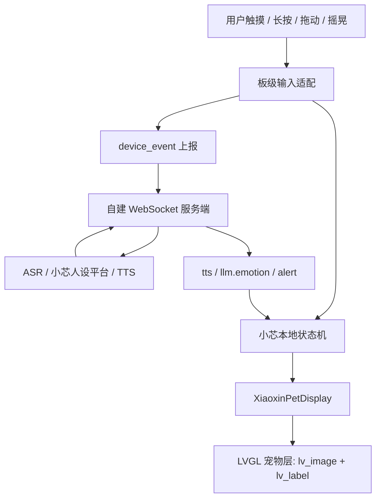

# 小芯硬件端桌宠 LVGL 接入方案

版本：2026-06-16  
项目：浙大城市学院信电学院“小芯”校园情感陪伴伙伴  
目标板：Waveshare ESP32-S3-Touch-LCD-1.46C  

## 1. 一句话结论

小芯硬件端首版应以“桌面情绪陪伴”为核心，把小芯形象常驻在 1.46 英寸圆形触摸屏上；动画渲染必须接入当前固件已有的 LVGL 显示体系，不再采用独立 `esp_lcd_panel_draw_bitmap` 直绘帧循环。

## 2. 背景

当前项目希望把浙大城市学院信电学院吉祥物“小芯”做成面向新生的 AI 情感陪伴伙伴。硬件端不是单纯语音聊天设备，而应该成为一个能被看见、被触摸、能做出即时反应的小型桌宠。

已有条件：

- 硬件板子已切换为 Waveshare ESP32-S3-Touch-LCD-1.46C。
- 项目后续服务端需要自建，不能依赖小智官方服务端。
- 小程序也会支持和小芯对话，并可触发小芯带路。
- 小芯角色人设已经部署在平台上，并完成文本对话测试。
- 当前固件仍基于小智架构，已有 OTA、WebSocket、音频、Display、Application 等抽象。

本方案的重点是硬件端 V1，不把小程序带路逻辑塞进固件。硬件端负责陪伴、语音交互、触摸/摇晃反馈、短提醒展示和事件上报。

## 3. 硬件目标

目标板为 Waveshare ESP32-S3-Touch-LCD-1.46C，关键能力包括：

- ESP32-S3R8，双核 LX7，最高 240MHz。
- 1.46 英寸圆形 LCD，分辨率 412 x 412。
- 8MB PSRAM，16MB Flash。
- 电容触摸，可运行 LVGL GUI。
- QMI8658 六轴 IMU，可用于摇晃和姿态类互动。
- 板载麦克风、喇叭和音频链路。
- Type-C、Micro SD、电池接口、BOOT/PWR 按键。

小芯形象参考图：

```text
C:\Users\dell\Downloads\57b262baeb5fec271711e4b802fc6b65.png
```

视觉方向：

- 薄荷绿与白色为主色。
- 毛绒、圆润、亲和。
- 保留大眼睛、耳罩、胸前圆形屏幕等关键识别元素。
- 屏幕动画不能退回默认 emoji 或旧桌宠形象。

## 4. 产品定位

硬件端首版定位为“校园桌面情绪陪伴伙伴”。

核心体验：

- 小芯常驻屏幕，看起来像一直陪在桌面上的伙伴。
- 用户可以直接摸它、长按它、拖动它、摇晃它。
- 小芯先在本地立刻给反馈，再视情况把事件发给服务端。
- 语音仍是主要 AI 对话入口。
- 长文本对话放在语音和小程序里，硬件屏幕只显示短状态。

硬件端不是：

- 不是小程序带路功能的执行端。
- 不是长聊天记录显示器。
- 不是长期记忆数据库。
- 不是独立脱离服务端的人设推理端。

## 5. 技术路线

### 5.1 采用 LVGL 接入

当前工程已经有 `SpiLcdDisplay` 和 LVGL 显示栈。小芯桌宠动画应作为 LVGL 页面里的一个宠物层运行：

- 使用 `lv_image` 显示小芯当前动画帧。
- 使用 `lv_timer` 或受 LVGL 锁保护的定时机制推进帧动画。
- 使用 `lv_label` 显示短状态文案。
- 使用 LVGL 事件处理触摸点击、长按、拖动。
- 继续保留系统通知、绑定态、网络状态等现有 UI 能力。

### 5.2 不采用独立 LCD 直绘

`D:\Learn\paopao_ui\firmware\paopao_pet` 的直绘帧动画方式可以作为参考，但不直接迁入当前固件。

原因：

- 当前固件已经使用 LVGL 管理屏幕，直绘会和 LVGL 抢屏。
- 直绘方式难以兼容系统状态栏、绑定提示、通知、低电量提醒等 UI。
- `Display::SetStatus`、`SetEmotion`、`SetChatMessage` 已经被应用层依赖，绕开 LVGL 会破坏现有抽象。
- 后续要接入触摸、短提醒、绑定态时，LVGL 对象模型更稳。

### 5.3 保留小智主链路

保留当前小智固件的主干：

- OTA 获取服务端配置。
- WebSocket 传输音频、文本和控制消息。
- I2S 麦克风和喇叭链路。
- `Application` 管理设备状态。
- `Display` 接口响应状态、情绪、聊天消息。
- MCP 协议能力保留。

服务端换成自建兼容实现，负责：

- ASR。
- 小芯人设平台调用。
- TTS。
- 长期记忆和身份体系。
- 小程序与硬件的账号绑定。
- 小程序带路业务编排。

## 6. 总体架构



硬件端只做“感知、反馈、展示、上报”。复杂业务逻辑留在服务端和小程序。

## 7. 屏幕体验设计

圆屏首屏应该直接展示小芯，不做营销页、不做复杂菜单。

默认布局：

- 中心：小芯主体动画。
- 底部安全区：短状态文案，例如 `聆听中`、`想一想`、`小芯说`。
- 临时覆盖层：绑定二维码或短码。
- 不显示长聊天字幕。

建议安全区：

```text
screen: 412 x 412
pet_safe_box: x=46, y=36, w=320, h=320
status_safe_box: x=76, y=338, w=260, h=42
```

## 8. 小芯状态

首版状态建议：

| 状态 | 含义 | 使用场景 |
| --- | --- | --- |
| `idle` | 待机 | 默认常驻 |
| `waiting` | 等待/连接 | Wi-Fi、WebSocket、服务端连接中 |
| `listening` | 聆听 | 用户开始说话 |
| `thinking` | 思考 | ASR 完成后等待人设平台或大模型回复 |
| `speaking` | 说话 | TTS 播放中 |
| `happy` | 开心/完成 | 用户触摸、互动完成、积极反馈 |
| `sleeping` | 休息 | 长按进入休息 |
| `running_left` | 向左移动 | 用户向左拖动 |
| `running_right` | 向右移动 | 用户向右拖动 |
| `failing` | 出错/委屈 | 网络错误、服务端错误、提醒失败 |

状态映射：

| 来源 | 条件 | 小芯状态 | 短状态 |
| --- | --- | --- | --- |
| 开机完成 | 进入待机 | `idle` | 空或 `待命` |
| 网络连接中 | Wi-Fi 或 WebSocket 未完成 | `waiting` | `连接中` |
| 用户单击 | 触摸点击 | `happy` | `我在呢` |
| 用户长按 | 睡眠切换 | `sleeping` / `idle` | `休息一下` / `醒啦` |
| 用户拖动 | 左右方向 | `running_left` / `running_right` | 空 |
| 用户摇晃 | 有效摇晃 | `thinking` 或 `happy` | `怎么啦` |
| 设备聆听 | `kDeviceStateListening` | `listening` | `聆听中` |
| 收到 STT | 用户语音识别完成 | `thinking` | `想一想` |
| TTS 开始 | `tts start` | `speaking` | `小芯说` |
| TTS 结束 | `tts stop` | `idle` 或 `listening` | 空 |
| LLM 情绪 | `llm.emotion` | 映射到对应状态 | 情绪短文案 |
| 服务端提醒 | `alert` | `happy` / `thinking` / `failing` | 服务端短提醒 |

## 9. 本地互动

触摸：

| 动作 | 本地反馈 | 上报事件 | 意图 |
| --- | --- | --- | --- |
| 单击 | 开心动画 | `pet_tap` | `mood_checkin` |
| 长按 | 进入/退出休息 | `pet_hold` | `sleep_toggle` |
| 向左拖动 | 向左移动动画 | `pet_drag` | `local_play` |
| 向右拖动 | 向右移动动画 | `pet_drag` | `local_play` |

摇晃：

- 使用 QMI8658 检测加速度变化。
- 需要阈值和冷却时间，避免误触发。
- 建议冷却时间 1200ms。
- 建议至少连续 2 个有效样本再确认摇晃。
- 摇晃先播放本地反馈，再尝试上报服务端。

弱网原则：

- 本地反馈不依赖 WebSocket。
- WebSocket 未连接时，不阻塞 UI。
- 首版不做复杂离线队列。

## 10. 服务端协议

设备仍通过自建 OTA 地址获取 WebSocket 配置，协议保持兼容小智风格。

### 10.1 hello 能力声明

WebSocket `hello.features` 增加：

```json
{
  "mcp": true,
  "device_events": true,
  "pet_display": "xiaoxin-lvgl-v1"
}
```

含义：

- `device_events`: 设备支持本地桌宠事件上报。
- `pet_display`: 当前屏幕实现为小芯 LVGL 桌宠 V1。

### 10.2 设备事件上行

```json
{
  "session_id": "...",
  "type": "device_event",
  "event": "pet_tap",
  "intent": "mood_checkin",
  "state": "idle",
  "ts": 123456
}
```

字段说明：

| 字段 | 说明 |
| --- | --- |
| `session_id` | 当前 WebSocket 会话 ID |
| `type` | 固定为 `device_event` |
| `event` | `pet_tap`、`pet_hold`、`pet_drag`、`pet_shake` |
| `intent` | `mood_checkin`、`sleep_toggle`、`local_play` |
| `state` | 当前小芯状态字符串 |
| `ts` | 设备毫秒时间戳 |

### 10.3 服务端下行

服务端可沿用现有消息：

- `tts`: 驱动说话状态和音频播放。
- `llm.emotion`: 驱动小芯情绪动画。
- `alert`: 驱动短提醒和临时状态。

硬件端只显示短提醒。长文本由语音播放或小程序展示。

## 11. 首次绑定

绑定推荐由小程序完成，硬件只提供绑定入口。

流程：

1. 设备通过自建 OTA 或 WebSocket 获取绑定短码/二维码内容。
2. `XiaoxinPetDisplay` 显示绑定临时层。
3. 用户在小程序扫码或输入短码。
4. 服务端确认绑定。
5. 硬件清除绑定层，回到 `idle` 小芯待机动画。

如果二维码组件尚未接入，首版可以先显示短码。

## 12. 固件改动范围

主要修改区域：

```text
D:\Learn\hzcu-xiaoxin-firmwire\sdkconfig.defaults
D:\Learn\hzcu-xiaoxin-firmwire\main\boards\waveshare\esp32-s3-touch-lcd-1.46
D:\Learn\hzcu-xiaoxin-firmwire\main\protocols
```

建议新增文件：

```text
main\boards\waveshare\esp32-s3-touch-lcd-1.46\xiaoxin_pet_display.h
main\boards\waveshare\esp32-s3-touch-lcd-1.46\xiaoxin_pet_display.cc
main\boards\waveshare\esp32-s3-touch-lcd-1.46\xiaoxin_pet_state.h
main\boards\waveshare\esp32-s3-touch-lcd-1.46\xiaoxin_pet_state.cc
main\boards\waveshare\esp32-s3-touch-lcd-1.46\xiaoxin_pet_assets.h
main\boards\waveshare\esp32-s3-touch-lcd-1.46\xiaoxin_pet_assets.cc
main\boards\waveshare\esp32-s3-touch-lcd-1.46\xiaoxin_pet_input.h
main\boards\waveshare\esp32-s3-touch-lcd-1.46\xiaoxin_pet_input.cc
```

建议修改文件：

```text
sdkconfig.defaults
main\boards\waveshare\esp32-s3-touch-lcd-1.46\esp32-s3-touch-lcd-1.46.cc
main\protocols\protocol.h
main\protocols\protocol.cc
main\protocols\websocket_protocol.cc
```

当前 `main\CMakeLists.txt` 会用 GLOB 收集板级 `.cc` 文件。新增板级源码后，执行一次：

```powershell
idf.py reconfigure
```

## 13. 实施顺序

1. 固化默认板级：把 `sdkconfig.defaults` 从旧 `AI_PET_S3` 改为 `WAVESHARE_ESP32_S3_TOUCH_LCD_1_46`。
2. 增加小芯状态机：先不碰 UI，只定义状态和迁移规则。
3. 增加 LVGL 资产合同：先用占位帧跑通接口。
4. 实现 `XiaoxinPetDisplay`：接入 LVGL 宠物层和短状态。
5. 替换 1.46 板级显示：让 `GetDisplay()` 返回小芯显示对象。
6. 接入触摸：单击、长按、拖动先完成本地动画。
7. 接入 QMI8658 摇晃：增加阈值、连续样本、冷却时间。
8. 增加 `device_event` 协议上报。
9. 接入服务端下行状态映射。
10. 替换正式小芯动画资产。

## 14. 测试计划

构建测试：

```powershell
idf.py reconfigure
idf.py build
```

真机测试：

- 开机显示小芯 idle 动画。
- 连接中、聆听、思考、说话、完成、错误状态能正确切换动画。
- 单击、长按、拖动、摇晃均有本地反馈。
- 弱网或服务端断开时，本地互动不卡顿。
- 短状态文案不越出圆形屏幕安全区。
- 长聊天文本不会覆盖小芯主体。
- 服务端能收到 `pet_tap`、`pet_hold`、`pet_drag`、`pet_shake`。
- 服务端下发 `tts`、`llm.emotion`、`alert` 后，硬件能切换状态。

## 15. 验收标准

- 硬件端首屏是小芯桌宠，而不是默认聊天字幕界面。
- 小芯动画运行在 LVGL 内，不存在独立抢屏的直绘循环。
- 语音链路、OTA、WebSocket、MCP 兼容现有小智架构。
- 自建服务端可以接收设备事件并控制硬件短状态。
- 小程序带路逻辑没有混入硬件 V1 固件。
- 正式小芯资产可以替换占位帧，不需要重写显示逻辑。

## 16. 主要风险

| 风险 | 处理方式 |
| --- | --- |
| 帧动画占用 Flash/PSRAM 过高 | 控制帧数、fps 和色彩格式，优先 RGB565 |
| 圆屏裁切文字 | 使用固定安全区，短状态限制宽度 |
| 摇晃误触发 | 加阈值、连续样本判断和冷却时间 |
| 触摸与按钮职责混乱 | 屏幕触摸只做桌宠互动，BOOT/PWR 保持原硬件职责 |
| 服务端未完全就绪 | 本地动画先独立跑通，协议上报非阻塞 |
| 正式素材未完成 | 先接占位帧，保持资产合同稳定 |

## 17. 和执行计划的关系

本文档是中文版方案说明，面向项目沟通和设计确认。

更细的逐步实施计划保存在：

```text
D:\Learn\hzcu-xiaoxin-firmwire\docs\superpowers\plans\2026-06-16-xiaoxin-lvgl-pet-plan.md
```
