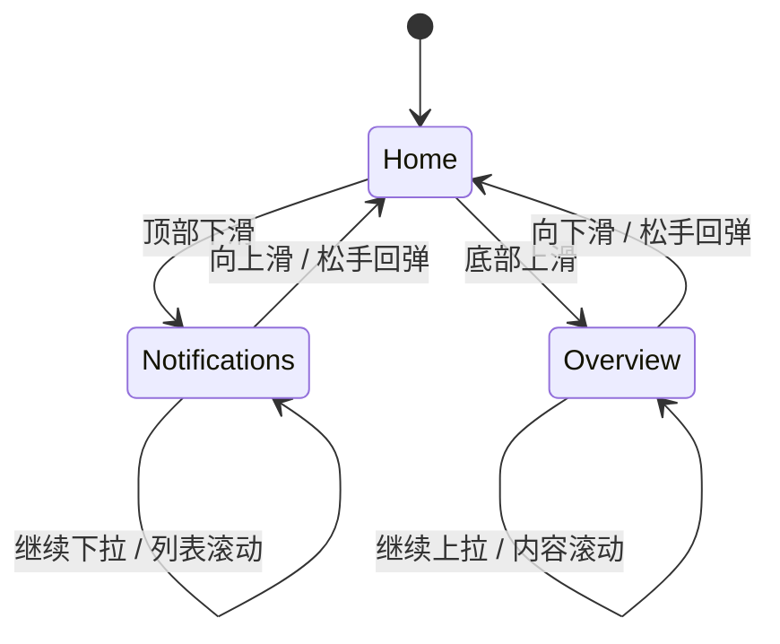

# 小芯竖向卡片切换计划

> 目标：在 Waveshare 1.46 圆屏上，把当前“中间宠物 + 顶部状态 + 底部字幕”的主页，扩展成一套可上下滑动的轻量卡片体系。

## 1. 目标

- **上滑进入总览页**：下一节课、天气、导航入口、今日待办。
- **下滑进入通知页**：课程变更、聊天提醒、低电量、异常提示。
- **主页常驻小芯**：宠物仍然是主视觉，不被页面逻辑淹没。
- **切换必须连贯**：卡片跟手移动、松手吸附、未到阈值回弹。

## 2. 页面定义

### 2.1 Home / 主页

- 中间：小芯动画。
- 顶部：状态栏。
- 圆屏右上安全区：全局 WiFi 和电量浮层。
- 底部：流式字幕。
- 用途：默认待机、聊天、情绪反馈。

### 2.2 Notifications / 通知页

- 进入方式：从屏幕顶部向下滑。
- 内容：
  - 课程变更
  - 聊天提醒
  - 低电量
  - 网络异常
- 风格：短、急、少。
- 建议只显示 1 到 3 条。

### 2.3 Overview / 总览页

- 进入方式：从屏幕底部向上滑。
- 内容：
  - 下一节课
  - 天气
  - 校园导航入口
  - 今日待办
- 风格：稳定、可扫读、信息密度略高于通知页。

## 3. 交互规则

- **上滑** = 进入总览页。
- **下滑** = 进入通知页。
- **反向滑动** = 返回主页。
- **轻点** = 当前页主动作。
- **长按** = 回主页或锁定当前页。

## 4. 状态机



## 5. 动画规则

### 5.1 跟手阶段

- 卡片位移跟随手指移动。
- 当前页、目标页同时参与位移。
- 不做硬切页。

### 5.2 吸附阶段

- 松手后判断是否超过切换阈值。
- 超过阈值：平滑吸附到目标页。
- 未超过阈值：弹回原页。

### 5.3 视觉连续性

- 当前页：正常大小、完整不透明。
- 邻接页：略缩小、略透明。
- 页面切换期间保持关键系统信息可见。
- 当前实现中，卡片页会隐藏原顶部状态栏和底部字幕，避免压住卡片内容；WiFi 和电量改由独立 `system_overlay_` 在圆屏安全区内常驻显示。

### 5.4 建议参数

- 切换阈值：屏幕高度的 18% 到 22%。
- 吸附时长：180 到 240 ms。
- 缓动：`easeOutCubic` 或同类缓出曲线。
- 最大超拖拽：约 25% 屏幕高度。

## 6. 页面内容优先级

### 通知页优先级

1. 低电量
2. 课程变更
3. 聊天提醒
4. 网络异常

### 总览页优先级

1. 下一节课
2. 校园导航
3. 天气
4. 今日待办

## 7. 与小程序的边界

- **小程序负责**
  - 课表导入
  - 地图和路径数据
  - 聊天内容
  - 提醒内容生成

- **硬件端负责**
  - 页面切换
  - 动画和吸附
  - 本地状态显示
  - 重要消息的即时提示

## 8. 建议数据模型

```cpp
enum class CardPage {
    Home,
    Notifications,
    Overview,
};

struct CardItem {
    std::string title;
    std::string body;
    std::string tag;
    uint32_t priority;
    uint32_t ttl_ms;
};
```

## 9. 实施步骤

- [ ] 定义 `CardPage` 和卡片数据结构。
- [ ] 增加竖向手势识别，区分上滑、下滑、回弹。
- [ ] 实现跟手位移和吸附动画。
- [ ] 接入通知页内容源。
- [ ] 接入总览页内容源。
- [ ] 保留 Home 页宠物主视觉不被覆盖。
- [ ] 补充小程序到硬件端的消息字段约定。
- [ ] 做实机验证，确认圆屏上切换连贯、无跳变。

## 10. 验收标准

- 从上往下滑能稳定进入通知页。
- 从下往上滑能稳定进入总览页。
- 松手后切换动画自然，没有明显跳帧。
- 未超过阈值时能够回弹。
- 宠物、系统信息、字幕在切换中保持识别感。
- WiFi 和电量在 Home、通知页、总览页都位于圆屏安全区内，不能被圆屏边缘裁切。

## 11. 推荐落地顺序

1. 先做 Home + 通知页 + 总览页三态。
2. 先接静态假数据。
3. 再接小程序消息。
4. 最后再加更细的导航、课表和提醒联动。

## 12. 当前实现补充记录

截至 2026-06-18，分页 UI 已补充圆屏安全区系统浮层：

- `system_overlay_` 挂在 `lv_screen_active()`，不属于 `card_layer_`。
- 浮层承载 WiFi `network_label_` 和全局电量 `battery_overlay_`。
- 浮层位置为 `LV_ALIGN_TOP_RIGHT, -76, 50`，优先保证 1.46 寸圆屏实机可见。
- 卡片页隐藏原 `top_bar_`、`status_bar_`、`bottom_bar_` 时，`system_overlay_` 仍会被 `RaiseOverlayObjects()` 提到前景。
- 通知卡片内部不再单独恢复四格电量显示，避免全局电量和卡片电量重复。
## 2026-06-18 当前实现补充：通知页内部连续滚动

### 最新结论

通知页内部不再采用“分页切换”作为主要体验，也不再采用左右滑切换通知。当前目标是：

- 通知页是一个竖向通知卡组。
- 通知卡组随手指连续滚动，避免“切换一张”的跳变感。
- 通知页本身仍然作为 Home 上方的抽屉页面存在。
- 只有通知卡组滚动到底部后，继续上滑才收回整个通知页。

### 与原计划的关系

原计划中“Notifications --> Home: 向上滑 / 松手回弹”需要增加前置条件：

```text
Notifications 内部通知卡组未到底：向上滑 = 滚动通知卡组
Notifications 内部通知卡组已到底：继续向上滑 = 收回通知页，返回 Home
```

也就是说，通知页有两层竖向手势：

1. 内层：通知卡组滚动。
2. 外层：通知页抽屉收回。

外层只有在内层已经到底时才接管。

### 当前手势分配

| 页面 | 手势 | 当前行为 |
|---|---|---|
| Home | 从上向下滑 | 进入通知页 |
| Home | 从下向上滑 | 进入总览页 |
| 通知页 | 竖向滑动，通知未到底 | 通知卡组按像素跟手滚动 |
| 通知页 | 顶部或底部越界 | 1/3 阻尼跟手，松手回弹 |
| 通知页 | 已到底后继续上滑 | 通知页整体收回到 Home |
| 通知页 | 横向滑动 | 不切换通知，不触发页面切换 |
| 通知页 | 长按 | 不返回 Home |
| 总览页 | 反向下滑 | 返回 Home |

### 当前实现要点

- `PaopaoPetDisplay` 新增：
  - `notification_scroll_y_`
  - `notification_drag_start_scroll_y_`
- 通知滚动范围由通知数量和 `k_notification_slide_pitch` 计算。
- 拖动过程中调用 `ApplyNotificationScrollVisual()`，直接更新通知卡组位置、透明度、阴影和底部圆点。
- 松手时调用 `AnimateNotificationScroll()`，只负责越界回弹或保留当前滚动位置。
- 外层页面回收仍走 `xiaoxin_card_pager_drag()` 和 `AnimateCardPagerRelease()`，但只在通知已滚到底时触发。

### 当前验收标准更新

- 从 Home 下滑能稳定进入通知页。
- 通知页内多条通知能通过竖向拖动连续浏览。
- 拖动过程中卡片必须跟手，不出现松手后才换卡的分页感。
- 顶部/底部越界时有阻尼感，松手后自然回弹。
- 通知未到底时，上滑不能收回通知页。
- 通知到底后继续上滑，才能收回通知页并返回 Home。
- 横向滑动不应切换通知，也不应误触发返回 Home。
- 长按通知页不应直接返回 Home。

### 已验证

- `xiaoxin_card_pager_test`：通过。
- `xiaoxin_battery_level_test`：通过。
- 当前 shell 未找到 `idf.py`，完整固件构建待 ESP-IDF 环境可用后执行。
## 2026-06-18 Smoothness optimization note

This round of card pager work treated visible stutter as a rendering-budget problem rather than a state-machine problem. The main improvement was to keep the notification drag path lightweight: while the finger is down, the UI now favors continuous position and opacity updates and avoids repeatedly reapplying the heavier card styling. Once the release animation starts, the richer settled card presentation returns. The home pet animation is also paused as soon as the card layer becomes visible, so full-screen pet frame copying does not compete with pager dragging.

Verification:
- `xiaoxin_card_pager_test`: passed
- `idf.py build`: not run here because `idf.py` is unavailable in this environment
- Device check: not run here because the required hardware is unavailable in this environment
